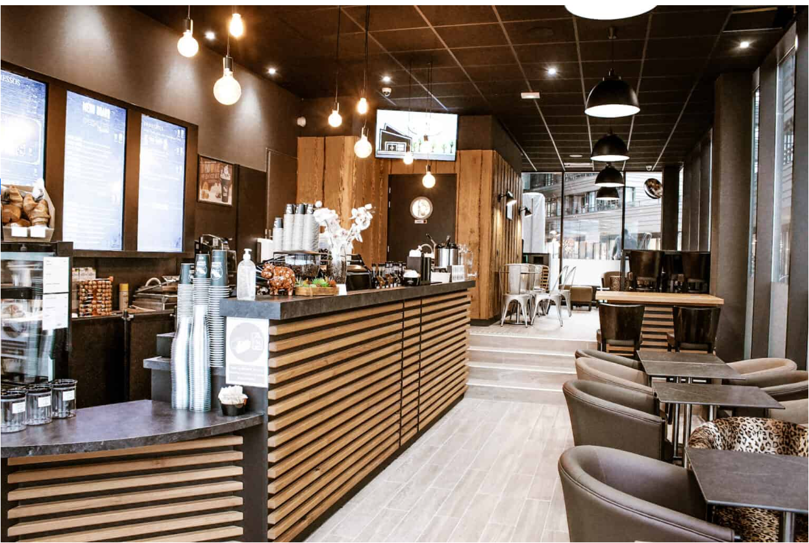

## Choco-coffee-store-analysis

### Introduction

This Excel projects provides a comprehensive overview of the purchase performance for an imaginary Coffee store called **Choco-Coffee**, over a given period of time. The Coffee sales dataset was organised and analyzed to answer crucial questions and gain insights to make strategc data driven decisions. This project includes organizing and analyzing purchase transactions, customer information, and product details of these datasets.

This report contains 3 pages:

You can interact with the project [here]()

- Worksheet
- Dashboard

*__Disclaimer__* : **_All dataset or report do no represent any Company, Institution or Country but its justa dummy dataset used to demonstrate capabilities of Excel._**

### Problem Statement
- What is total revenue per month, and what month has the highest revenue?
- Which product sells the most?
- What day has the highest sales?
- What hour of the day is the rush hour?

### Skills / Concept demonstrated
I used Power Query to clean and transform the data while using Power Pivot to analyse and create models. Other tools used includes; slicers, filters, DAX. Leveraging visualization tools, I created charts, graphs, and pivot tables to showcase key Performance metrics.

## Chart
### filter -----------------------| -------------------------- Chart
----------|---------- 

## Analysis
- Total Revenue by Month

   
This chart shows the revenue generated between Jan - June. The highest at $56,957 and $27,821, it also shows that there is steady rise from february until June.

- Transaction by the Hour of the Day
  

This chart shows the hours of the day the store records the highest sales which is between 8hrs and 10hrs. The most sales is at the 10hrs, with 6957 transactions.

- Transaction by Day
  
 

  
- Transaction by Product Category
  

This chart shows highest selling product in the store. Coffee sells the highest (20187), followed by Tea (15277) and the Bakery (7617).
 
